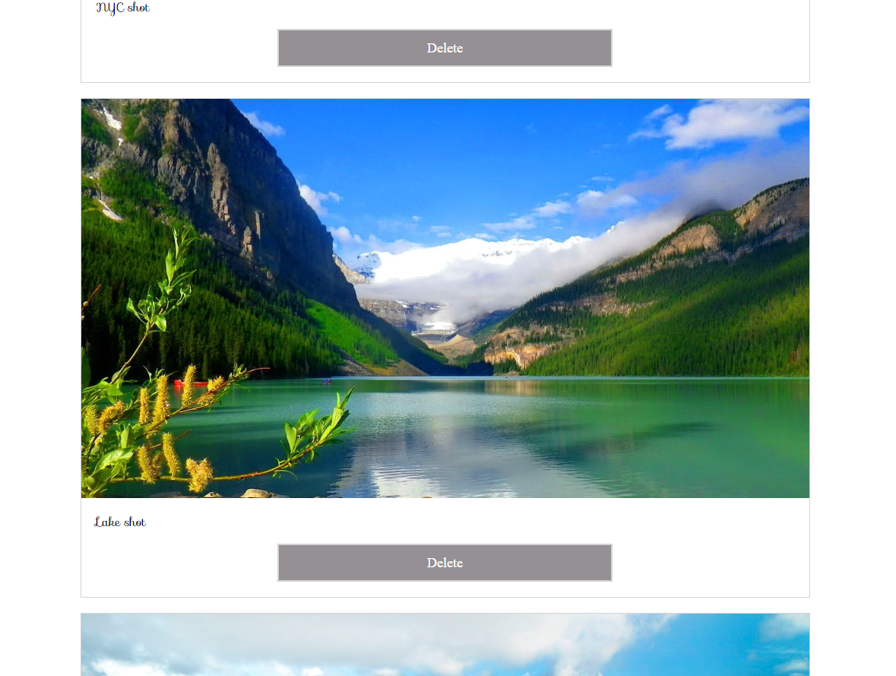

# Pristine Pics

## About

Pristine Pics is an app built with React, which allows users to upload and display or delete photos.

## How to run 

* Clone the project - git clone https://github.com/emilyjspencer/Pristine-Pics.git
* cd into the repo
* In the terminal, type the following to install the dependencies:
```html
* Then, enter the following:
npm start
```
The application will open automatically in the browser at localhost:3000


## Built with

* React
* JavaScript
* HTML/CSS


## What it looks like:





