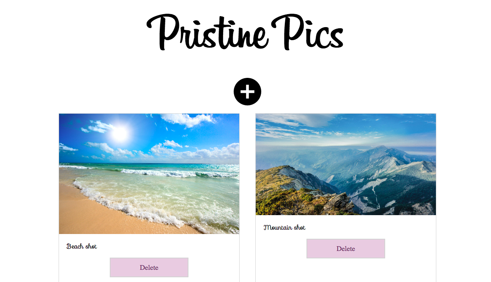

# Pristine Pics

# About

Pristine Pics is an app built with React, which allows users to upload and display or delete photos.


##### Pristine Pics is deployed with Surge at: [this link](http://guiltless-clouds.surge.sh/)!


### How to run: 

* Clone the project - git clone https://github.com/emilyjspencer/Pristine-Pics.git
* cd into the repo
* In the terminal, type the following to install the dependencies:
```html
npm install
```
* Then, enter the following:
```html
npm start
```
The application will open automatically in the browser at localhost:3000


### Built with:

* React
* HTML/CSS

### What it looks like:





### Deployed with Surge at: [this link](http://guiltless-clouds.surge.sh/)!


